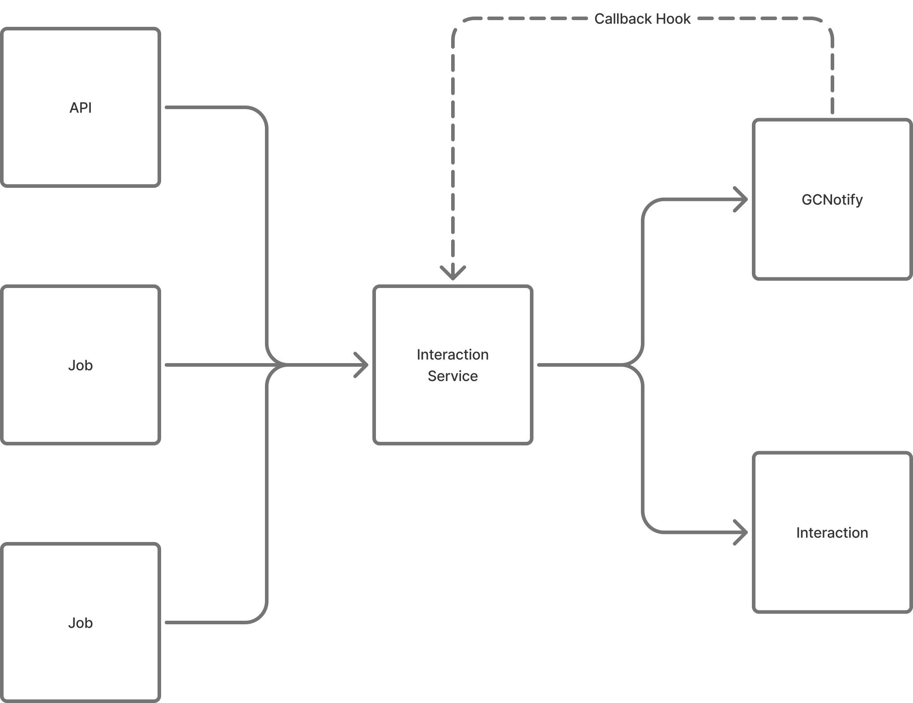

- **Start Date:** 2026-02-02
- **Target Major Version:** # Email Tracking and Correction
- **Reference Issues:** N/A
- **Entity Issue:** [32213](https://github.com/bcgov/entity/issues/32213)
- **Implementation PR:** (leave this empty)
# Summary

Implement a centralized **Interaction Logging** system to track all outbound communication (SMS, Email, System Alerts) and manual notations. This system serves as a "Source of Truth" for audit trails and acts as a state-machine to enable idempotent, resumable batch jobs by tracking the lifecycle of each contact attempt.

# Basic example

Python

```
from enum import Enum

class InteractionStatus(Enum):
    SENT = "sent"
    DELIVERED = "delivered"
    FAILED = "failed"
    OPENED = "opened"

# Dispatching a message within a batch job
comm_service.dispatch(
    customer_id=101,
    channel=ChannelType.EMAIL,
    template_key="order_confirm",
    payload={"order_id": 55},
    idempotency_key="batch_66_user_101" # Logic skips if "sent" or "delivered" exists
)
```

# Motivation

Outbound communications are currently fragmented, preventing verification of delivery or support context. Furthermore, our current jobs lack "checkpointing," meaning a crash during a bulk send requires manual intervention to avoid duplicate messaging. Standardizing these into a single table with enforced Enums ensures data integrity and operational resilience.

# Detailed design

A new service that can manage and tracks all client interactions.



### 1. The Entity Schema (SQLAlchemy)

The `Interaction` table tracks metadata and delivery proof using Enums for state management.

Python

```
from base import BaseEnum, auto
from sqlalchemy import Enum as SQLEnum

class ChannelType(BaseEnum):
    EMAIL = auto()
    SMS = auto()
    PHONE = auto()
    SYSTEM = auto()

class InteractionStatus(BaseEnum):
    SENT = auto()
    DELIVERED = auto()
    FAILED = auto()
    OPENED = auto()

class CustomerInteraction(Base):
    __tablename__ = "interactions"

    id: Mapped[int] = mapped_column(primary_key=True)
    interaction_uuid: Mapped[str] = mapped_column(String(36), unique=True, index=True)
    customer_id: Mapped[int] = mapped_column(index=True)
    
    # tracking this was successfully sent, and the run that covered it
    idempotency_key: Mapped[Optional[str]] = mapped_column(String(255), unique=True, index=True)
    
    # Enum-based fixed fields
    channel: Mapped[ChannelType] = mapped_column(SQLEnum(ChannelType))
    status: Mapped[InteractionStatus] = mapped_column(
        SQLEnum(InteractionStatus), 
        default=InteractionStatus.SENT
    )
    
    body_content: Mapped[Optional[str]] = mapped_column(Text)
    
    # Callback transaction link for audit
    notify_reference: Mapped[Optional[str]] = mapped_column(String(100), index=True)
    provider_reference: Mapped[Optional[str]] = mapped_column(String(100), index=True)
    meta_data: Mapped[Optional[dict]] = mapped_column(JSON) 
    created_at: Mapped[datetime] = mapped_column(DateTime, default=datetime.utcnow)
```

### 2. The Communication Service Module

The service abstracts provider logic and enforces the logging/idempotency contract.

|**Method**|**Parameters**|**Description**|
|---|---|---|
|**`dispatch()`**|`customer_id`, `ChannelType`, `idempotency_key`, `payload`|Sends message and logs interaction. Skips if `idempotency_key` exists.|
|**`get_history()`**|`customer_id`, `limit`|Returns chronological "Timeline" for a customer.|
|**`update_status()`**|`provider_ref`, `InteractionStatus`|Updates record via provider webhooks (e.g., transitioning "sent" to "delivered").|
|**`add_note()`**|`customer_id`, `content`|Logs manual phone call notations as a `ChannelType.PHONE` interaction.|

### 3. Batch Resumption Logic

By using the `idempotency_key`, a failed job can be restarted. The service checks for an existing record with a non-failed status before triggering the provider, allowing the job to "pick up" exactly where it left off (e.g., at person 63 of 100).

# Drawbacks

- **Database Volume:** High-frequency logging will lead to rapid table growth.
- **Complexity:** Enforcing Enums requires careful handling of migrations if new channels or statuses are added.

# Alternatives

- **String-only Statuses:** Using raw strings instead of Enums. _Rejected: Lacks the type safety and validation needed for a reliable state-machine._

# Adoption strategy

1. **Phase 1:** Deploy the `Interaction` table with Enum types.
2. **Phase 2:** Integrate with the Email/SMS gateway to capture provider references.
3. **Phase 3:** Update batch notification jobs to use `idempotency_keys` for crash recovery.

# Data Retention & Archiving

- **Hot Storage:** 24 months in the production database for immediate access.
- **Cold Storage:** 7 years in compressed archival format for legal compliance.
- **Janitor Task:** Monthly automated job to move expired records to cold storage

# Unresolved questions

- **Encryption:** Should we encrypt the `body_content` for PII/Sensitive data?

# Thanks

This template is heavily based on the Vue, Golang, React, and other RFC templates.